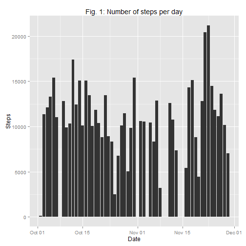
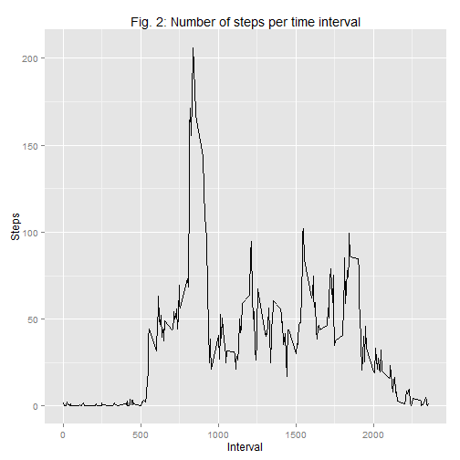
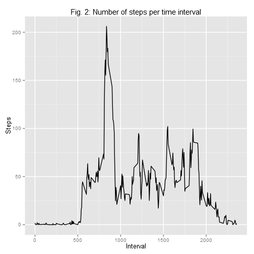
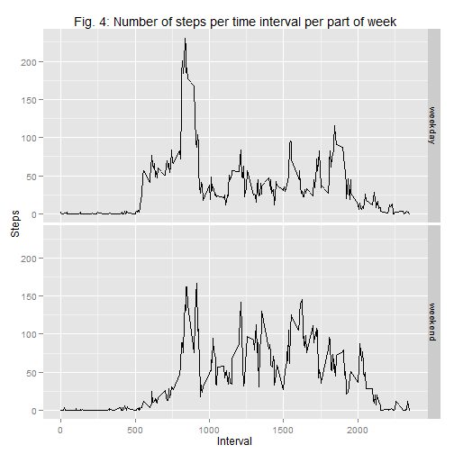

*Make sure to read READNE.md for additional information as to the scope of this research and instruction on how to obtain the data needed for the analysis.*

## Loading and preprocessing the data

We will load the data from the csv file provided with the assignment. Make sure said file has been extracted from its archive.


```r
# Load data set and convert date format to POSIX
activity <- read.csv("activity.csv", stringsAsFactors = FALSE)
activity$date <- as.Date(activity$date)
```

## What is mean total number of steps taken per day?


```r
# Calculate steps taken each day
daily.steps <- aggregate(steps ~ date, activity, sum, na.rm = TRUE)
names(daily.steps) <- c("date", "steps")

# Plot steps taken each day
library(ggplot2)
```

```
## Use suppressPackageStartupMessages to eliminate package startup messages.
```

```r
qplot(data = daily.steps, x = date, y = steps, stat = "identity",
      geom = "bar") + labs(title = "Fig. 1: Number of steps per day",
                           x = "Date", y = "Steps")
```

 

```r
# Calculate mean and median of steps per day
mean.steps.day <- print(mean(daily.steps$steps))
```

```
## [1] 10766
```

```r
median.steps.day <- print(median(daily.steps$steps))
```

```
## [1] 10765
```

## What is the average daily activity pattern?


```r
# Calculate average steps taken each interval
steps.intervals <- aggregate(steps ~ interval, activity, mean)
names(steps.intervals) <- c("interval", "steps")

# Plot average steps taken each interval
qplot(data = steps.intervals, x = interval, y = steps, geom = "line") +
    labs(title = "Fig. 2: Number of steps per time interval",
         x = "Interval", y = "Steps")
```

 

```r
# Find interval with highest average steps
steps.intervals[which.max(steps.intervals$steps), ]
```

```
##     interval steps
## 104      835 206.2
```

## Imputing missing values

First we will locate and quantify missing values.


```r
# Find what variables contain na and in what quantity
count.na <- apply(activity, 2, is.na)
apply(count.na, 2, sum)
```

```
##    steps     date interval 
##     2304        0        0
```

We will fill missing values with the mean of the steps taken for every 5-minute interval.


```r
# Substitute missing values with mean of steps per interval
activity.filled <- merge(activity, steps.intervals, by = "interval")
activity.filled$steps <- ifelse(is.na(activity.filled$steps.x),
                                activity.filled$steps.y,
                                activity.filled$steps.x)
activity.filled <- activity.filled[ , c(1, 3, 5)]

# Plot steps taken each days with imputed missing values
qplot(data = activity.filled, x = date, y = steps, stat = "identity",
      geom = "bar") +
    labs(title = "Fig. 3: Number of steps per day, imputing missing values",
                           x = "Date", y = "Steps")
```

 

Lastly we will assess the impact of imputing missing values on the accuracy of our calculations.


```r
# Calculate steps taken each day with imputed missing values
daily.steps.filled <- aggregate(steps ~ date, activity.filled, sum, na.rm = T)

# Calculate mean and median of steps per day with imputed missing values
mean.steps.day.filled <- print(mean(daily.steps.filled$steps))
```

```
## [1] 10766
```

```r
median.steps.day.filled <- print(median(daily.steps.filled$steps))
```

```
## [1] 10766
```

```r
# Calculate percent difference between imputing and non imputing missing values
pct.diff <- function(x, y) {((x-y)/x)*100}
pct.diff(mean.steps.day.filled, mean.steps.day)
```

```
## [1] 0
```

```r
pct.diff(median.steps.day.filled, median.steps.day)
```

```
## [1] 0.01104
```

According to the above data, the impact of imputing missing values is negligible for our data set.

## Are there differences in activity patterns between weekdays and weekends?


```r
# Determine whether a date falls in a weekday or weekend
weekend.days <- c("Saturday", "Sunday")
activity.filled$daytype <- weekdays(activity.filled$date)
activity.filled$daytype <- ifelse(activity.filled$daytype %in% weekend.days,
                                  "weekend", "weekday")
activity.filled$daytype <- factor(activity.filled$daytype)

# Plot a comparison of steps taken per time interval between work days and weekend days
steps.intervals.filled <- with(activity.filled,
                              aggregate(steps, list(daytype, interval), mean))
names(steps.intervals.filled) <- c("daytype", "interval", "steps")
qplot(data = steps.intervals.filled, x = interval, y = steps, geom = "line") +
    labs(title = "Fig. 4: Number of steps per time interval per part of week",
                            x = "Interval", y = "Steps") +
    facet_grid(daytype ~ .)
```

 
